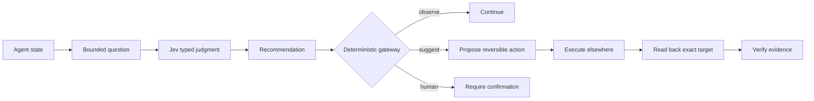

# Jev Decisions

### A typed judgment layer for Hermes and other AI agents

[](LICENSE)
[](https://www.python.org/)

Jev Decisions gives an agent a small, explicit boundary between **judgment** and **execution**.

Use it when an agent must answer questions such as:

- Is this action safe to suggest?
- Does the evidence prove that the action succeeded?
- Is this output grounded and complete?
- Which option is best supported?
- Should the agent act, ask one question, wait for evidence, or stop?

Jev supplies typed judgments. Deterministic code retains authority. The project never executes a model recommendation.

> **Status:** v0.1.0, usable now for Hermes plugins, Python agents, shell workflows, and service integrations. Keep Jev advisory until your own labeled evaluation supports stronger automation.

## The boundary



The model answers a narrow question. Your agent decides what authority is required. Your integration performs the action. Your integration reads the target back and checks the result.

## Why it exists

Agent systems tend to fail at the seams. They act on weak evidence, confuse a claim with proof, retain private material forever, or continue analyzing after the next action is clear.

Jev Decisions turns those seams into named, inspectable decisions. Each decision has a bounded input, a typed output, a recorded authority, and a visible next step.

The project has two layers:

1. **Semantic judgment:** Jev evaluates bounded state through Noul, Choice, or Score questions.
2. **Execution boundary:** local deterministic rules classify risk and verification requirements. They do not defer authority to the model.

## Install in Hermes

Clone the project into the Hermes plugin directory:

```bash
git clone https://github.com/bojansandhaus/jev-decisions.git \
  ~/.hermes/plugins/jev-decisions

hermes plugins enable jev-decisions
hermes plugins doctor jev-decisions
```

Restart Hermes after installing or changing plugin code. The plugin registers the `jev` toolset, five tools, and three advisory hooks without modifying Hermes core.

Configure the provider key through Hermes secret management or the environment. Never put a live key in this repository:

```bash
export OPENROUTER_API_KEY="..."
```

The provider defaults are:

```text
Endpoint: https://openrouter.ai/api/alpha/decisions
Model:    typesafe/jev-1.13
```

The Hermes adapter reads `OPENROUTER_API_KEY` through the active Hermes secret scope when available. It sends only the bounded state supplied by the caller. Redact credentials, private correspondence, full archives, and unnecessary personal data before creating state.

## Use from any Python agent

The repository is not tied to Hermes at the policy boundary. Install it into a Python environment:

```bash
python3 -m pip install .
```

The standalone package exposes the deterministic gateway through Python modules and a command line program:

```bash
jev-gateway decide <<'JSON'
{"action":"restart_service","external":true,"reversible":true}
JSON
```

Expected shape:

```json
{
  "authority": "deterministic_policy",
  "decision": "suggest",
  "reason": {
    "credential": false,
    "destructive": false,
    "external": true,
    "reversible": true
  }
}
```

Verify a state change:

```bash
jev-gateway verify <<'JSON'
{"changed":true,"read_back":false,"evidence":false}
JSON
```

The gateway returns `read_back` until the exact target has been inspected:

```json
{
  "authority": "deterministic_verification",
  "next": "read_back",
  "verified": false
}
```

You can also call it from Python:

```python
from gateway import decide, verify

policy = decide({
    "action": "restart_service",
    "external": True,
    "reversible": True,
})

verification = verify({
    "changed": True,
    "read_back": True,
    "evidence": True,
})
```

This gives other agent frameworks a stable, provider independent safety boundary. To add Jev semantic judgments, call the Decisions API from your framework, then pass the result through the same local policy and verification boundary. See [docs/integrations.md](docs/integrations.md).

## Hermes tools

| Tool | Purpose |
| --- | --- |
| `jev_decide` | Run a custom typed Noul, Choice, or Score judgment. |
| `jev_workflow` | Run one of the reusable bounded workflows. |
| `jev_gateway` | Apply deterministic policy, verification, classification, or snapshot operations. |
| `jev_ingest` | Classify a bounded event from another system and open a Jev case. |
| `jev_ledger` | Record reviews, outcomes, commitments, decisions, and local metrics. |

### Advisory hooks

| Hook | Review |
| --- | --- |
| `pre_tool_call` | Prospective tool risk and verification depth. |
| `post_tool_call` | Whether returned evidence proves success. |
| `post_llm_call` | Grounding, completeness, actionability, risk, and decision circling. |

Hooks run in shadow mode. They observe and record. They do not block, rewrite, approve, deny, or execute.

## Typed questions

Jev accepts a map of named questions. Every question declares a type, instructions, and criteria.

```json
{
  "state": {
    "action": "restart_service",
    "external": true,
    "reversible": true
  },
  "questions": {
    "risk": {
      "type": "choice",
      "instructions": "What is the operational risk?",
      "criteria": {
        "low": "Read only or easily reversible",
        "medium": "Recoverable service or file change",
        "high": "Destructive, credential related, or broad outage risk"
      }
    },
    "needs_human": {
      "type": "noul",
      "instructions": "Should a human confirm before execution?",
      "criteria": {
        "true": "Authority or safety is materially uncertain",
        "false": "The action is clear, authorized, reversible, and verified"
      }
    }
  }
}
```

The primitives are:

- **Noul:** calibrated true or false judgment.
- **Choice:** selection from named options.
- **Score:** placement on an ordered rubric.

Jev returns structured answers, probabilities, and usage metadata. The adapter does not ask Jev for prose.

## Workflow catalog

The plugin ships 25 reusable workflow definitions:

| Area | Workflows |
| --- | --- |
| Output and progress | `goal_judge`, `output_review`, `next_action`, `decision_circling`, `plan_review` |
| Tools and actions | `command_review`, `action_verify`, `tool_result_verify`, `verification_depth`, `escalation` |
| Memory and evidence | `memory_gate`, `memory_review`, `memory_maintenance`, `recall_rerank`, `claim_status`, `evidence_review` |
| Comparison and choice | `agent_referee`, `option_select`, `purchase_review` |
| Operations | `anomaly_review`, `daily_anomaly`, `infrastructure_review`, `document_quality` |
| Communication and promotion | `communication_review`, `promotion_review` |

These are decision classes, not hard coded integrations. Home Assistant, infrastructure, document systems, research, communication, purchasing, and personal workflows can pass bounded state through the same boundary.

## Deterministic authority

The gateway is deliberately stricter than the model:

```python
from gateway import decide, verify

policy = decide({
    "action": "delete_backup",
    "external": True,
})
assert policy["decision"] == "human"

check = verify({
    "changed": True,
    "read_back": False,
    "evidence": False,
})
assert check["next"] == "read_back"
```

Policy outcomes:

- `observe`: no external effect is present.
- `suggest`: a reversible external action may be proposed.
- `human`: confirmation is required.

Verification outcomes:

- `done`: no further proof is required.
- `read_back`: inspect the exact target.
- `inspect_evidence`: examine logs or equivalent direct evidence.

The gateway never runs the requested operation.

## Cases, ledger, and calibration

The append only ledger records structured metadata for reviews, outcomes, commitments, and decisions. It is designed for local calibration, not for storing private conversation transcripts.

The case layer can classify bounded events from domains such as infrastructure, Home Assistant, documents, research, communication, purchases, and health. It records a case state and outcome without requiring a domain specific connector.

The default path is advisory:

1. The agent creates bounded, redacted state.
2. Jev returns typed answers.
3. The gateway applies deterministic policy.
4. The agent executes only within its own authority model.
5. The agent reads the exact target back.
6. The ledger records the outcome for later evaluation.

Keep Jev in shadow mode until labeled outcomes show that a workflow is reliable enough for your use case.

## Privacy and security

The public project contains code, generic fixtures, and documentation only. It must never contain:

- API keys, tokens, passwords, or secret files
- Hermes sessions, logs, memory, or local calibration records
- personal names, addresses, identifiers, or private case data
- generated bytecode, caches, or machine specific configuration

Run the scanner before every release or push:

```bash
python3 tools/public_scan.py
```

Read [SECURITY.md](SECURITY.md) before sending state to an external model provider. Treat every model answer as untrusted data. Keep human confirmation and deterministic checks in front of irreversible actions.

## Development

```bash
python3 -m pip install -e '.[test]'
python3 -m pytest -q
python3 -m compileall -q .
python3 tools/public_scan.py
```

The normal test suite makes no network request. A live provider check is optional and requires an API key supplied outside the repository.

## Repository layout

```text
jev-decisions/
├── __init__.py       Hermes plugin entrypoint and typed workflows
├── gateway.py        Deterministic policy and verification
├── ledger.py         Append only local records
├── ingest.py         Cross system event classification
├── fabric.py         Jev case queue
├── jev_gateway.py    JSON gateway for non Hermes callers
├── shadow_report.py  Review and calibration report
├── plugin.yaml       Hermes manifest
├── runtime.py        Hermes or standalone runtime bridge
├── tools/            Public safety scanner
├── tests/            Generic behavior tests
├── docs/             Integration guidance
└── pyproject.toml    Python package metadata and CLI entrypoint
```

## Design principles

1. Keep model judgments typed and bounded.
2. Keep execution authority deterministic.
3. Require human authority for destructive or uncertain actions.
4. Verify state changes against the exact target.
5. Store structured evidence, not private raw content.
6. Promote narrow workflows only after labeled evaluation.
7. Keep the public project free of local state.

## License

MIT. See [LICENSE](LICENSE).
