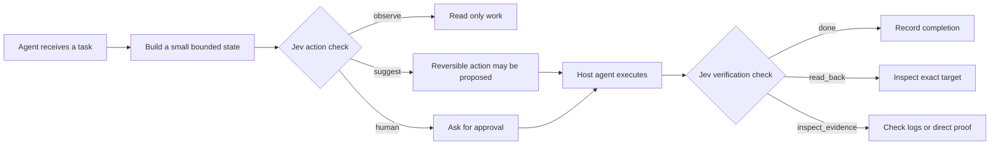

<div align="center">
  <h1>Jev Decisions</h1>
  <p><strong>Safety checks for Hermes and other AI agents.</strong></p>
  <p>Know when to act. Know when to ask. Know when the work is actually done.</p>

  <p>
    <a href="https://github.com/bojansandhaus/jev-decisions/actions/workflows/ci.yml"></a>
    <a href="LICENSE"></a>
    <a href="https://www.python.org/"></a>
  </p>

  <p>
    <a href="#quick-start">Quick start</a> ·
    <a href="#use-cases">Use cases</a> ·
    <a href="docs/integrations.md">Integrate another agent</a> ·
    <a href="#frequently-asked-questions">FAQ</a>
  </p>
</div>

Jev Decisions is an **AI agent safety and verification layer**. It sits between an agent's plan and its external effect, then checks the result after the action. It helps agents use tools carefully, request human approval when needed, and stop claiming success before the evidence is in.

Use it as a **Hermes plugin** or as a small **Python and command line package** behind another AI agent, MCP server, automation script, or workflow runner.

> **The short version:** Jev Decisions does not take control away from your agent. It gives the agent a clear safety boundary before action and a proof boundary after action.

## Why Jev Decisions exists

An agent can choose the wrong tool. It can act with more authority than the task allows. It can receive a `success` response from a tool and report a finished job even though the target never changed.

Those are not exotic failures. They are what happens when planning, permission, execution, and verification blur together.

Jev Decisions separates them.

| Before an action | After an action |
| --- | --- |
| Is this read only or externally consequential? | Did the exact target change? |
| Is it reversible? | Is the result supported by direct evidence? |
| Does a person need to approve it? | Should the agent finish, read back, inspect, retry, or ask? |

The host agent still owns credentials, permissions, tool execution, retries, and the final approval flow. Jev Decisions makes the judgment explicit and gives the host a structured answer.

## The product in one picture



Example: an agent wants to delete an old backup. Jev Decisions can classify the action as destructive and external, require human approval, and require a direct check after the approved deletion. The agent remains in charge. The safety decision becomes visible, testable, and auditable.

## What you get

### A ready Hermes plugin

Install the repository as a Hermes plugin and receive five tools plus three advisory hooks:

| Tool | Plain English purpose |
| --- | --- |
| `jev_decide` | Ask a bounded yes or no question, choose an option, or give a score. |
| `jev_workflow` | Run a prepared review for a common agent situation. |
| `jev_gateway` | Check whether an action needs approval and whether its result is proven. |
| `jev_ingest` | Turn an event from another system into a reviewable case. |
| `jev_ledger` | Record structured review results without storing private conversation text. |

| Hook | What it checks |
| --- | --- |
| `pre_tool_call` | Whether a planned tool call needs caution or approval. |
| `post_tool_call` | Whether the result proves that the requested change worked. |
| `post_llm_call` | Whether an answer is grounded, complete, useful, and moving forward. |

The hooks observe recommendations. They do not secretly execute, rewrite, approve, or deny an action.

### A small gateway for any agent

The local gateway works without a network request. Any agent that can call Python or a command can use it.

```python
from gateway import decide, verify

policy = decide({
    "action": "restart_service",
    "external": True,
    "reversible": True,
})

if policy["decision"] == "human":
    raise RuntimeError("Human approval is required")

# The host agent performs the approved operation here.
result = verify({
    "changed": True,
    "read_back": True,
    "evidence": True,
})

assert result["verified"] is True
```

The same boundary can sit behind a Python agent, shell script, MCP tool, HTTP service, workflow runner, or another agent framework. Only the plugin registration layer is specific to Hermes.

## Quick start

### Install in Hermes

Clone the product into the Hermes plugin directory:

```bash
git clone https://github.com/bojansandhaus/jev-decisions.git \
  ~/.hermes/plugins/jev-decisions

hermes plugins enable jev-decisions
hermes plugins doctor jev-decisions
```

Restart Hermes after installing or changing the plugin. Keep provider keys outside the repository, in the active Hermes secret scope or your environment:

```bash
export OPENROUTER_API_KEY="your-key"
```

The default provider settings are:

```text
Endpoint: https://openrouter.ai/api/alpha/decisions
Model:    typesafe/jev-1.13
```

### Install for another AI agent

Jev Decisions can run as a local Python package behind another agent:

```bash
git clone https://github.com/bojansandhaus/jev-decisions.git
cd jev-decisions

python3 -m venv .venv
. .venv/bin/activate
python3 -m pip install .
```

Ask whether an action should need a person:

```bash
echo '{"action":"delete_backup","external":true}' \
  | jev-gateway decide
```

A typical result is structured data the host agent can enforce:

```json
{
  "authority": "deterministic_policy",
  "decision": "human",
  "reason": {
    "destructive": true,
    "external": true
  }
}
```

Then check whether the action is actually proven:

```bash
echo '{"changed":true,"read_back":false,"evidence":false}' \
  | jev-gateway verify
```

The host agent receives a `read_back` recommendation instead of permission to claim completion.

See [docs/integrations.md](docs/integrations.md) for Python, shell, service, MCP, and framework integrations.

## Use cases

### Safer tool use

Review a planned change to a file, server, database, device, online record, or service before the tool runs. Destructive, credential related, or difficult to reverse work can require a person.

### Human approval for AI agents

Keep the approval boundary clear. Jev Decisions recommends when a human should decide. Your host agent presents the request and enforces the answer.

### Action verification

A tool can return `success` while the requested change failed, reached the wrong target, or never happened. Jev Decisions makes read back and direct evidence part of the completion path.

### Better agent answers

Review whether a draft uses the supplied evidence, answers every requested part, avoids invented claims, and gives a specific next step when one is needed.

### Memory review

Before saving information, check whether it is useful later, sensitive, redundant, or in conflict with existing memory.

### Research and evidence

Classify a claim as observed, inferred, assumed, unverified, or contradicted. Ask for stronger evidence when the claim matters.

### Messages and email

Before sending, review the recipient, commitment, sensitive information, attachments, and readiness of the draft.

### Infrastructure and home automation

Review service changes, backups, restores, alerts, Home Assistant events, and other operations through the same action and verification boundary.

### Decisions and comparisons

Compare options, review a purchase, rank candidates, or referee multiple agent answers without letting the judge perform the final action.

## Ready made reviews

The Hermes plugin includes 25 reusable reviews:

| Area | Reviews |
| --- | --- |
| Goals and answers | `goal_judge`, `output_review`, `next_action`, `decision_circling`, `plan_review` |
| Tools and actions | `command_review`, `action_verify`, `tool_result_verify`, `verification_depth`, `escalation` |
| Memory and evidence | `memory_gate`, `memory_review`, `memory_maintenance`, `recall_rerank`, `claim_status`, `evidence_review` |
| Choices | `agent_referee`, `option_select`, `purchase_review` |
| Operations | `anomaly_review`, `daily_anomaly`, `infrastructure_review`, `document_quality` |
| Communication | `communication_review`, `promotion_review` |

These reviews take bounded information. They do not require a separate connector for every service.

<details>
<summary><strong>See a typed Jev question</strong></summary>

A Jev question has a type, clear instructions, and definitions for the possible answers.

```json
{
  "state": {
    "action": "send_email",
    "external": true,
    "creates_commitment": true
  },
  "questions": {
    "ready": {
      "type": "noul",
      "instructions": "Is this message ready to send?",
      "criteria": {
        "true": "The recipient, commitment, and facts are clear",
        "false": "Something important needs review first"
      }
    },
    "next": {
      "type": "choice",
      "instructions": "What should happen next?",
      "criteria": {
        "send": "Send it",
        "revise": "Revise it first",
        "ask": "Ask one clarifying question",
        "hold": "Do not send yet"
      }
    }
  }
}
```

The three question types are:

- **Noul:** yes or no, with a confidence estimate.
- **Choice:** one option from a named list.
- **Score:** a position on an ordered scale.

The answer is structured data. Your agent decides what to do with it.

</details>

## Safety rules

The local gateway returns one of three action recommendations:

- `observe`: no outside change is involved;
- `suggest`: a reversible outside action may be proposed;
- `human`: approval is required.

Verification returns one of three next steps:

- `done`: the available proof is enough;
- `read_back`: inspect the exact target;
- `inspect_evidence`: examine logs or another direct source of proof.

A model answer never overrides these checks. A missing key, timeout, malformed answer, or unclear result is not permission to act.

## Privacy by design

Send the smallest amount of information needed for the judgment. The host agent chooses what state reaches a provider.

Do not send credentials, private messages, full archives, complete memory records, or unrelated personal information. Do not commit keys, tokens, passwords, local logs, caches, bytecode, or machine specific settings.

Run the public scan before a release:

```bash
python3 tools/public_scan.py
```

Read [SECURITY.md](SECURITY.md) for the complete security policy.

## Why this is a good product

Jev Decisions works at the narrowest point in an agent system: the moment before intent becomes an external effect, and the moment after an agent claims that the effect happened.

It stays small. It keeps execution with the host. It makes approval visible. It turns verification into a concrete operation instead of a promise. It can start in advisory mode, gather structured outcomes, and become stricter only where your own evidence supports that choice.

That gives you a practical path to safer AI agents without replacing the framework you already use.

## Frequently asked questions

### What is Jev Decisions?

Jev Decisions is an AI agent safety and verification layer. It helps an agent decide when to act, when to ask a human, and how to check that an action really worked.

### Does Jev Decisions work with Hermes?

Yes. It ships as a Hermes plugin with five tools, three advisory hooks, and 25 ready made reviews.

### Does Jev Decisions work with other AI agents?

Yes. The local policy and verification gateway works from Python, the shell, a service, an MCP tool, or another agent framework. Only plugin registration is Hermes specific.

### Does Jev Decisions execute actions?

No. The host agent performs actions. Jev Decisions reviews the proposed action and checks the evidence afterward.

### Does it replace human approval?

No. Destructive, credential related, unclear, or difficult to reverse actions remain subject to the host agent's approval rules.

### Does it store my conversations?

The project is designed to store structured review metadata rather than raw conversation text. Your host agent controls what state is sent to the provider.

### Which provider does the Hermes plugin use?

The default Hermes adapter uses OpenRouter's Decisions API with `typesafe/jev-1.13`. Other agent frameworks can use the local gateway with their own provider or model.

### Is Jev Decisions free to use?

The repository is available under the MIT License. Provider charges, if any, depend on the provider and model you choose.

## Development

```bash
python3 -m pip install -e '.[test]'
python3 -m pytest -q
python3 -m compileall -q .
python3 tools/public_scan.py
```

The test suite makes no network request. A live provider test is optional and must use a key outside the repository.

## Repository layout

```text
jev-decisions/
├── __init__.py       Hermes plugin and review definitions
├── gateway.py        Local action and verification rules
├── ledger.py         Local structured records
├── ingest.py         Event classification
├── fabric.py         Case queue
├── jev_gateway.py    JSON command line gateway
├── shadow_report.py  Review and calibration report
├── plugin.yaml       Hermes manifest
├── tools/            Public safety scanner
├── tests/            Generic tests
├── docs/             Integration guidance
└── pyproject.toml    Python package and CLI metadata
```

## License

MIT. Copyright (c) 2026 Bojan Sandhaus. See [LICENSE](LICENSE).
